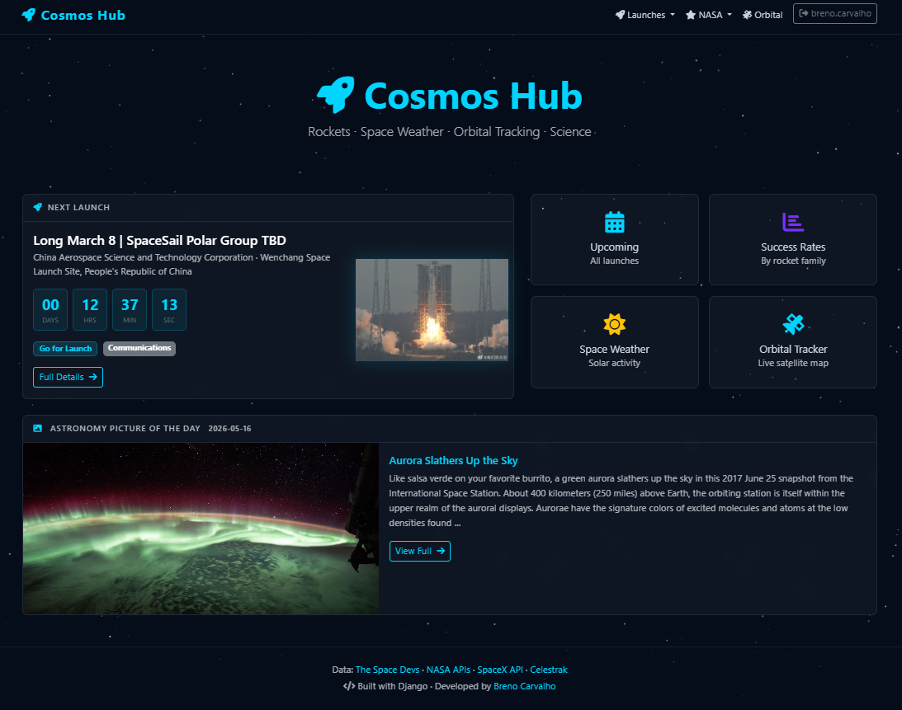

🇧🇷 **Português** | 🇺🇸 [English](README.md)

---

# Breno Torres

**Cientista de Dados & Engenheiro de ML**

Lidero um time de Data & Analytics e atuo em todo o ciclo de ML — modelagem estatística, design de experimentos, pipelines de MLOps e deploy em produção. Também aceito projetos freelance envolvendo ciência de dados, machine learning e desenvolvimento backend.

---

### No que posso ajudar

- **Machine learning de ponta a ponta** — do entendimento do problema e feature engineering até seleção de modelos, validação e deploy
- **MLOps & pipelines** — workflows orquestrados e reproduzíveis que realmente rodam em produção
- **Backends de dados** — APIs e dashboards que conectam modelos a usuários reais

---

### Stack

---

### Projetos

#### [Cosmos Hub](https://cosmos-hub-xvf2.onrender.com) — Plataforma de Dados Espaciais em Tempo Real

> O acesso ao site é restrito. Para solicitar uma demonstração ou discutir um projeto, entre em contato: [cosmos.hub.dev@proton.me](mailto:cosmos.hub.dev@proton.me)

Plataforma web orientada a dados que agrega informações espaciais em tempo real de múltiplas APIs:

- Rastreamento de lançamentos ao vivo com countdown e detalhes da missão
- Simulação física de trajetória de ascensão (Tsiolkovsky + Newton + integração RK4) com memorial de cálculo por ponto nos gráficos
- Mapa orbital de satélites em tempo real
- Foto Astronômica do Dia da NASA + Clima Espacial (DONKI)

**Stack:** Django · Plotly · The Space Devs LL2 API · NASA API · Skyfield · CockroachDB · Render

---

### Contato

[LinkedIn](https://www.linkedin.com/in/brenotorrescarvalho/) · [brenotorrescarvalho@gmail.com](mailto:brenotorrescarvalho@gmail.com)

---

> "Um modelo que não pode ser colocado em produção é só um projeto de pesquisa."
